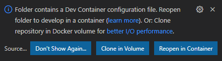

===========
Development
===========

Includes
    - Debian based, per vscode devcontainer recommended base
    - Lint: flake8
    - Formater: black
    - QoL plugins for vscode
    - Added programs
        - jq
        - poetry

Setup
*****

#. You need to have `Visual Studio Code <https://code.visualstudio.com/>`_ a.k.a vscode installed with `Remote Development Extension Pack <https://marketplace.visualstudio.com/items?itemName=ms-vscode-remote.vscode-remote-extensionpack>`_.
#. Fork this repo
#. Open the forked project in vscode
#. You will see this dialog box

6. Press :guilabel:`Reopen in Container`
7. Now you will ready to start coding. You have all things you need installed. Check :ref:`development` for what is installed.

Docs
****

All commands for docs need to run from the docs folder

Docs are written in rst and we are using sphinx to generate all the needed output.

.. note::
    Don't forget to run :code:`make clean` when sphinx gets weird

To audobuild html docs when developing

.. code-block:: sh

    sphinx-autobuild . _build/html/ --watch ../.
    # OR use the alias
    autobuild-html-docs

Intersphinx
***********

Intersphinx is a fantastic tool that enables you to automatic cross-reference and generating links other projects that uses sphinx.
Run ``docs-helper`` and use the interactive guide to help with linking

* `docs-helper <http://docs-helper.rtfd.io/>`
* `rtd docs <https://docs.readthedocs.io/en/stable/guides/intersphinx.html>`_ about intersphinx
* `sphobjinv <https://github.com/bskinn/sphobjinv>`_ is a tool to help linking with cross-reference

Diagrams
********

There is support for automatically generating diagrams from text with `kroki <https://kroki.io/>`_
See https://github.com/sphinx-contrib/kroki for more info

.. kroki::
    :type: blockdiag

    blockdiag {
    Kroki -> generates -> "Block diagrams";
    Kroki -> is -> "very easy!";

    Kroki [color = "greenyellow"];
    "Block diagrams" [color = "pink"];
    "very easy!" [color = "orange"];
    }

PDF output
**********

Output to pdf is supported with `rinohtype <https://www.mos6581.org/rinohtype/master/>`_

To build pdf run:

.. code-block:: sh

    # (cd docs)
    sphinx-build -b rinoh . _build/rinoh -t pdf
    # OR use the alias
    build-pdf